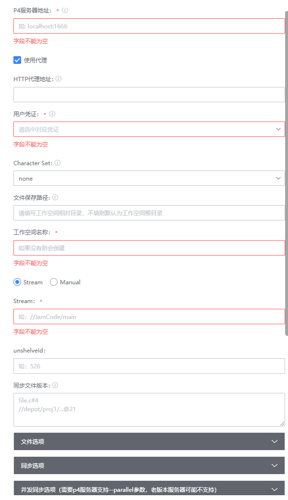

# Perforce 拉取插件
全功能实现p4 sync
## 插件功能
* 支持Stream和经典仓库
* 支持自动创建工作空间
* 支持password和ticket两种认证方式
* 支持HTTP代理
* 支持SSL
* 支持unshelve
* 支持文件选项
* 支持p4 FileSpec和RevSpec，即自定义拉取
* 支持同步参数配置
* 支持并发同步和相关参数配置
* 适用场景
* 需要同步p4服务器文件
* 本地不想装p4环境，一键同步

## 使用指南

### 一、新增插件

在蓝盾的研发商店->工作台->新增插件 页面，

各字段值填写如下:

名称: PerforceSync（这个可以自定义)

标识: PerforceSync

调试项目: 选择自己的项目

开发语言: java

自定义前端: 否

### 二、配置插件

当插件上架后，就可以在流水线中选择插件，插件配置如下:

- p4服务器地址：需要同步的p4服务器地址，支持ssl
- http代理地址：如果需要代理，则填写代理地址
- 用户凭证：蓝盾填入的（用户名+密码）凭证
- Character Set: 拉取过程使用的字符编码，需要服务器开启Unicode
- 文件保存路径：工作空间的相对目录
- Stream: Stream仓库
- Manual: 非Stream仓库，手动配置ViewMapping
- unshelveId: shelve的changeNo
- 同步文件版本：p4支持的FileSpec和RevSpec,每行一个Spec
- 文件选项：同步使用的一些文件选项，默认勾选Clobber，否则更新可能会出错
- 同步选项：同步的选项，注意有些选项相互存在冲突，不能同时选中
- 并发同步选项：同步使用的并发选项（需要p4服务器支持--parallel参数，老版本服务器可能不支持）

## 常见的失败原因和解决方案
* ticket过期

  刷新ticket或者发布更长时间的ticket，如不过期的ticket
* 同步文件版本格式不对

  参考https://www.perforce.com/manuals/v20.2/cmdref/Content/CmdRef/p4_sync.html#p4_sync

